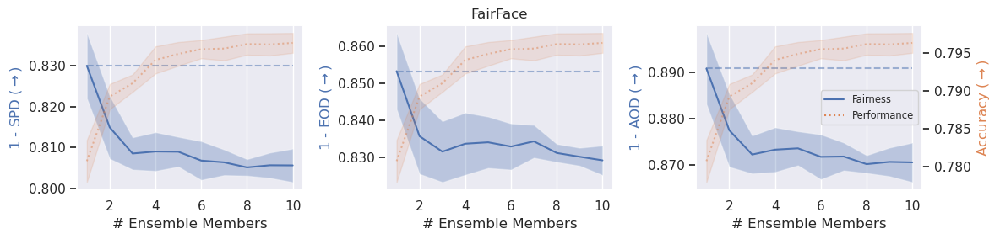

# The Disparate Benefits of Deep Ensembles

[](https://arxiv.org/abs/2410.13831)
[](LICENSE)

Kajetan Schweighofer<sup>1</sup>, Adrian Arnaiz-Rodriguez<sup>2</sup>, Sepp Hochreiter<sup>1,3</sup>, Nuria Oliver<sup>2</sup>

<sup>1</sup> ELLIS Unit, LIT AI Lab, Institute for Machine Learning, JKU Linz, Austria  
<sup>2</sup> ELLIS Alicante, Alicante, Spain  
<sup>3</sup> NXAI GmbH, Linz, Austria  

## Summary

This project explores the impact of Deep Ensembles on algorithmic fairness, revealing that performance gains from Deep Ensembles can unevenly favor different protected groups, leading to _disparate benefits_. 
Through empirical analysis on facial analysis and medical imaging datasets, our study identifies differences in the average predictive diversity as a potential cause for the effect.
Finally, we demonstrate that post-processing techniques can effectively alleviate the negative implications on fairness due to the disparate benefits effect, reducing unfairness while maintaining performance improvements of Deep Ensembles.



## Setup

To change where the datasets are loaded, results are stored, etc. change paths in [constants.py](/source/constants.py).  
The environment can be installed via
```
conda env create -f environment.yml
conda activate disparate_benefits
```
If you faced issues installing the environment from the file directly or experience broken packages (we had them on some machines for pytorch), installing the packages manually one after another resolved these issues for us.

## Setting up the Face Detection Experiments

Download the files from [https://www.kaggle.com/datasets/abhikjha/utk-face-cropped](https://www.kaggle.com/datasets/abhikjha/utk-face-cropped) as they are no longer accessible on the original website [https://susanqq.github.io/UTKFace/](https://susanqq.github.io/UTKFace/).

## Setting up Medical Imaging Experiments

First, follow the instructions given in [setup_chexpert.py](./setup_chexpert.py) for downloading raw data and run the file to create a downsized version of it for faster experiments and move the necessary csv files containing label and protected attribute information.
An account at https://stanfordaimi.azurewebsites.net is needed to download this dataset.

## Replicating the Results

Run the [train_face_detection_ensemble.py](train_face_detection_ensemble.py) and [train_medical_imaging_ensemble.py](train_medical_imaging_ensemble.py) in all desired configurations. The configurations to replicate are stated in the paper and are basically the standard configs for all combinations of targets, networks and seeds (42, 142, 242, 342 and 442).
Afterwards, execute the [eval_face_detection_ensemble.ipynb](eval_face_detection_ensemble.ipynb) and [eval_medical_imaging_ensemble.ipynb](eval_medical_imaging_ensemble.ipynb) to calculate the preds.
Then, all other analysis files analyze_xxx.ipynb can be executed.

## Contact

If you have any questions around the code or the paper itself, feel free to reach out to schweighofer@ml.jku.at

## Citation

If you find this work useful, please cite

```
@article{schweighofer2024disparate,
    title={The Disparate Benefits of Deep Ensembles}, 
    author={Kajetan Schweighofer and Adrian Arnaiz-Rodriguez and Sepp Hochreiter and Nuria Oliver},
    journal={arXiv preprint arXiv:2410.13831},
    year={2024}
}
```